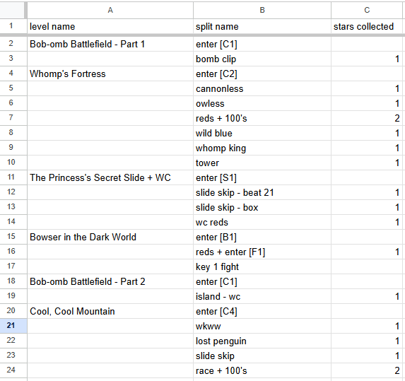

# SplitsGenerator
- This is a program that generates splits to copy into LiveSplit.
- Simply download the .exe from releases and it should work fine.
- If you know python, you can download the .py files and do what you want with it.

## How to
- Download the .exe from [releases](https://github.com/Dackage353/SplitsGenerator/releases)
- Open the .exe
- Copy your split data directly from google sheets into the textbox. (It will include tabs which are used by the program as a separator)
- Pick your options and then press a button

If using subsplits and star counts, use 3 columns. If using only subsplits or star counts, use 2 columns
