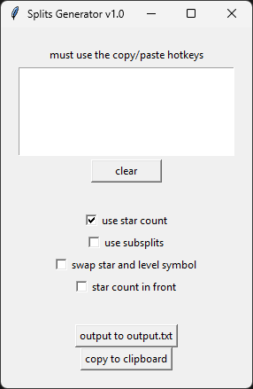

# SplitsGenerator
- This is a program that generates splits to copy into LiveSplit.
- Use it to make splits with subsplits and/or star counts.

## How to
- Download the .exe from [releases](https://github.com/Dackage353/SplitsGenerator/releases)
- Open the .exe
- Copy your split data directly from google sheets into the textbox. (No header row)
- Simply pick your options, then click output or copy

If using subsplits and star counts, use 3 columns. If using only subsplits or star counts, use 2 columns
